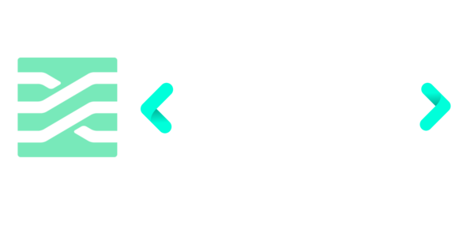

<div align="center">
  <a target="_blank" href="https://www.change.org/p/sign-and-share-this-urgent-petition-calling-for-a-ceasefirenow-in-gaza-and-israel" alt="Cease Fire in Gaza Now!">
     
  </a>
</div>

<p align="center">
  <a target="_blank" href="https://www.stimulus-store.com" alt="Stimulus Store Documentation site">
     
  </a>
</p>

<div align="center">
  
  [](https://github.com/omarluq/stimulus-store)
  [](https://github.com/omarluq/stimulus-store/actions/workflows/test.yml)
  [](https://netlify.com)
  [](https://github.com/omarluq/stimulus-store/commits/main)
  [](https://github.com/omarluq/stimulus-store/graphs/commit-activity)
  [](https://github.com/omarluq/stimulus-store/graphs/contributors)
  [](https://github.com/omarluq/stimulus-store/pulls)
  [](https://github.com/omarluq/stimulus-store/pulls?q=is%3Apr+is%3Aclosed)
  [](https://github.com/omarluq/stimulus-store/issues)
  [](https://github.com/omarluq/stimulus-store)
  [](https://github.com/omarluq/stimulus-store/stargazers)
  [](https://github.com/omarluq/stimulus-store/network/members)
  [](https://github.com/omarluq/stimulus-store/watchers)
  [](https://www.typescriptlang.org)
  [](https://biomejs.dev)
  [](https://codeclimate.com/github/omarluq/stimulus-store/maintainability)
  [](https://codeclimate.com/github/omarluq/stimulus-store/test_coverage)
  [](https://npmjs.com/package/stimulus-store)
  [](https://npmjs.com/package/stimulus-store)
  [](https://bundlephobia.com/result?p=stimulus-store@0.0.2)
  [](https://bundlephobia.com/result?p=stimulus-store@0.0.2)
  [](https://bundlephobia.com/result?p=stimulus-store@0.0.2)
  [](https://github.com/omarluq/stimulus-store)
  [](https://github.com/omarluq/stimulus-store)
  [](https://github.com/omarluq/stimulus-store)
  [](https://dependabot.com)
  [](https://github.com/omarluq/stimulus-store)
  [](https://discord.gg/ScU4JKgxaU)
  
</div>

</br>

<p align="center">
  <b>Ultra lightweight state management for your Stimulus powered web applications.</b>
</p>

</br>

- **Create and manage global state with ease.** 🔄
- **Share state between different controllers effortlessly using a unified, atomic `Store` class.** 🔀
- **1.04KB Minified and Brotlied** 🪶

## Installation

### With a build system

Install with [npm](https://www.npmjs.com/):

```sh
npm install stimulus-store
```

Install with [yarn](https://yarnpkg.com):

```sh
yarn add stimulus-store
```

### UMD

Coming 🔜

## Documentation

complete documentation on Stimulus Store, including guides, API details, and more can be found on [www.stimulus-store.com](https://www.stimulus-store.com).

## Contributors ✨

Thanks goes to these wonderful people ([emoji key](https://allcontributors.org/docs/en/emoji-key)):

<!-- ALL-CONTRIBUTORS-LIST:START - Do not remove or modify this section -->
<!-- prettier-ignore-start -->
<!-- markdownlint-disable -->
<table>
  <tbody>
    <tr>
      <td align="center" valign="top" width="14.28%"><a href="https://github.com/tcarac"><br /><sub><b>Tomas Caraccia</b></sub></a><br /><a href="https://github.com/omarluq/stimulus-store/commits?author=tcarac" title="Code">💻</a> <a href="https://github.com/omarluq/stimulus-store/commits?author=tcarac" title="Tests">⚠️</a> <a href="https://github.com/omarluq/stimulus-store/commits?author=tcarac" title="Documentation">📖</a> <a href="#maintenance-tcarac" title="Maintenance">🚧</a> <a href="https://github.com/omarluq/stimulus-store/pulls?q=is%3Apr+reviewed-by%3Atcarac" title="Reviewed Pull Requests">👀</a> <a href="#question-tcarac" title="Answering Questions">💬</a></td>
      <td align="center" valign="top" width="14.28%"><a href="https://omarluq.github.io/portfolio/"><br /><sub><b>Omar Luq </b></sub></a><br /><a href="https://github.com/omarluq/stimulus-store/commits?author=omarluq" title="Code">💻</a> <a href="https://github.com/omarluq/stimulus-store/commits?author=omarluq" title="Tests">⚠️</a> <a href="https://github.com/omarluq/stimulus-store/commits?author=omarluq" title="Documentation">📖</a> <a href="#maintenance-omarluq" title="Maintenance">🚧</a> <a href="https://github.com/omarluq/stimulus-store/pulls?q=is%3Apr+reviewed-by%3Aomarluq" title="Reviewed Pull Requests">👀</a> <a href="#question-omarluq" title="Answering Questions">💬</a></td>
    </tr>
  </tbody>
  <tfoot>
    <tr>
      <td align="center" size="13px" colspan="7">
        
          <a href="https://all-contributors.js.org/docs/en/bot/usage">Add your contributions</a>
        </img>
      </td>
    </tr>
  </tfoot>
</table>

<!-- markdownlint-restore -->
<!-- prettier-ignore-end -->

<!-- ALL-CONTRIBUTORS-LIST:END -->

This project follows the [all-contributors](https://github.com/all-contributors/all-contributors) specification. Contributions of any kind welcome!

</br>

## License

This project is licensed under the MIT License - see the [LICENSE.md](LICENSE.md) file for details.
