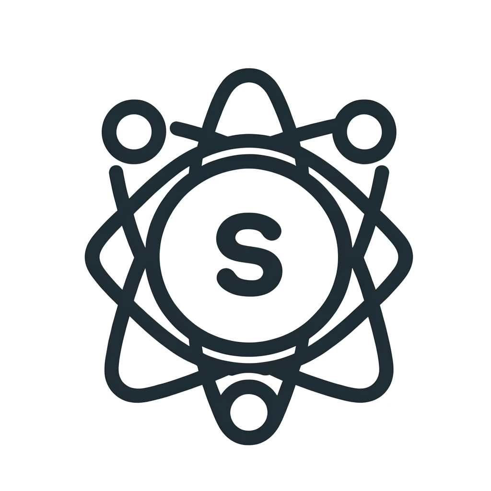

   

  <!-- Project Status Badges -->
  
  
  
  
  <!-- Contribution Badges -->
  
  
  
  
  
  <!-- Popularity Badges -->
  
  
  
  <!-- Development Standards Badges -->
  
  
  
  
  <!-- Download and Package Size Badges -->
  
  
  
  
  
  <!-- Miscellaneous Badges -->
  
  
  
  
  

 

  <b>Ultra lightweight state management in your Stimulus powered web applications.</b>

 

- **Create and manage global state with ease.** 🔄
- **Share state between different controllers effortlessly using a unified, atomic `Store` class.** 🔀
- **1.04KB Minified and Brotlied** 🪶